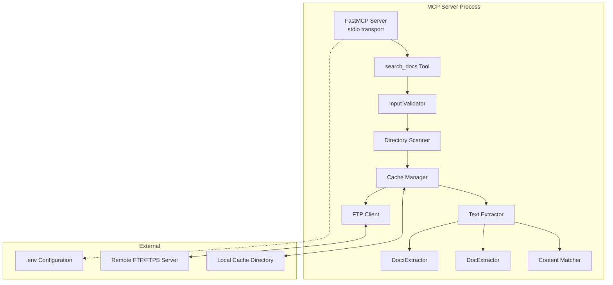
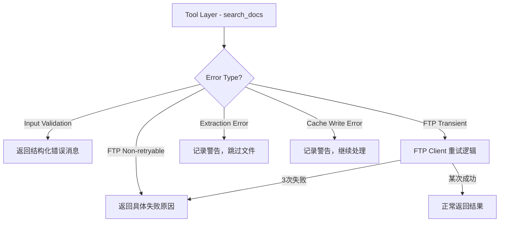

# Design Document: ftp-doc-reader-mcp

## Overview

本文档描述了 **ftp-doc-reader-mcp** 的技术设计方案。该项目是一个基于 Python 的 MCP（Model Context Protocol）服务器，暴露一个 `search_docs` 工具，用于在远程 FTP/FTPS 服务器的指定目录中递归搜索 `.doc` 和 `.docx` 文件，提取文本内容并根据用户提供的查询关键词进行大小写不敏感的内容匹配，最终返回匹配的文件路径及相关上下文片段。

该服务器基于官方 [MCP Python SDK](https://github.com/modelcontextprotocol/python-sdk) 的 FastMCP 高级 API 构建，使用 stdio 传输方式，适合与 AI 助手（Claude Desktop、Cursor 等）集成，并可通过 `uvx` 部署。

**核心设计决策：**
- **FastMCP 装饰器风格**：最小化样板代码；一个 `@mcp.tool()` 装饰的异步函数定义工具。
- **Python 标准库 `ftplib`**：无需外部 FTP 库；`ftplib.FTP` 和 `ftplib.FTP_TLS` 覆盖 FTP/FTPS，完全控制超时和重试。
- **`python-docx` 处理 .docx**：业界标准的 Office Open XML 文档解析库。
- **`olefile` 处理 .doc**：纯 Python 的 OLE2 解析器，无需外部二进制工具（如 antiword），跨平台可移植。
- **本地文件缓存 + 基于文件大小的失效策略**：避免重复下载，保持失效判断简单且确定性。
- **递归目录扫描**：自动发现指定目录及子目录下所有 Word 文档，用户无需知道具体文件路径。
- **大小写不敏感的关键词匹配 + 上下文片段**：快速定位相关文档并提供匹配上下文。

## Architecture



**请求处理流程：**
1. MCP 宿主调用 `search_docs`，传入 `query`（搜索关键词）和 `directory_path`（FTP 目录路径）。
2. Input Validator 校验参数合法性（非空、长度限制）。
3. Directory Scanner 通过 FTP Client 递归遍历 `directory_path` 及其子目录，发现所有 `.doc`/`.docx` 文件（最深 10 层、最多 200 个文件）。
4. 对每个发现的文件，Cache Manager 检查本地缓存是否有效（基于文件大小比较）。
5. 若缓存失效或不存在，FTP Client 下载文件（含重试逻辑）。
6. Text Extractor 解析本地文件，提取纯文本。
7. Content Matcher 对提取的文本执行大小写不敏感的关键词匹配，生成上下文片段。
8. 汇总所有匹配结果，按匹配片段数量降序排序后返回。

## Components and Interfaces

### 1. MCP Server Entry Point (`server.py`)

主模块，初始化 FastMCP 服务器并注册工具。

```python
from mcp.server.fastmcp import FastMCP

mcp = FastMCP("ftp-doc-reader")

@mcp.tool()
async def search_docs(query: str, directory_path: str) -> list[dict] | str:
    """Search .doc/.docx files in a remote FTP directory for content matching the query."""
    ...
```

**职责：**
- 启动时通过 `ConfigLoader` 加载配置
- 注册 `search_docs` 工具
- 编排 验证 → 目录扫描 → 缓存/下载 → 文本提取 → 内容匹配 → 结果排序 管线
- 返回 `SearchResult` 列表或结构化错误消息

### 2. Configuration Loader (`config.py`)

```python
@dataclass(frozen=True)
class FTPConfig:
    host: str
    port: int
    username: str
    password: str
    protocol: Literal["FTP", "FTPS"]
    cache_dir: Path

def load_config() -> FTPConfig:
    """Load and validate configuration from .env file."""
    ...
```

**职责：**
- 使用 `python-dotenv` 读取 `.env` 文件
- 验证必填字段（host、username、password）
- 应用默认值（port=21、protocol=FTP）
- 验证端口范围（1–65535）和协议值
- 配置无效时终止启动并输出明确错误信息

### 3. Input Validator (`validator.py`)

```python
def validate_search_params(query: str, directory_path: str) -> None:
    """Validate search_docs input parameters. Raises ValueError on invalid input."""
    ...
```

**职责：**
- 校验 `query` 非空且长度在 1–500 字符范围内
- 校验 `directory_path` 非空且长度在 1–1024 字符范围内
- 验证在任何 FTP 操作之前执行

### 4. Directory Scanner (`scanner.py`)

```python
class DirectoryScanner:
    def __init__(self, ftp_client: FTPClient): ...

    async def scan(self, directory_path: str) -> ScanResult:
        """Recursively scan remote directory for .doc/.docx files.
        
        Returns ScanResult with list of remote file paths.
        Max depth: 10, max files: 200.
        """
        ...

@dataclass
class ScanResult:
    files: list[str]          # discovered file paths
    truncated: bool           # True if file limit (200) was reached
    warnings: list[str]       # skipped directories, etc.
```

**职责：**
- 通过 FTP Client 递归遍历远程目录及所有子目录
- 过滤仅保留以 `.doc` 或 `.docx` 结尾的文件（大小写不敏感）
- 限制递归深度不超过 10 层
- 限制发现的文档文件总数不超过 200 个
- 遇到无权限的子目录时跳过并记录警告日志
- 目录不存在时返回明确的错误

### 5. FTP Client (`ftp_client.py`)

```python
class FTPClient:
    def __init__(self, config: FTPConfig): ...

    async def list_directory(self, path: str) -> list[tuple[str, str]]:
        """List directory contents. Returns list of (name, type) tuples.
        type is 'file' or 'dir'.
        """
        ...

    async def download(self, remote_path: str, local_path: Path) -> None:
        """Download file with retry logic (3 attempts, 2s delay)."""
        ...

    async def get_size(self, remote_path: str) -> int | None:
        """Get remote file size via SIZE command. Returns None on failure."""
        ...
```

**职责：**
- 根据配置建立 FTP 或 FTP_TLS 连接
- 每次连接/下载强制 30 秒超时
- 实现重试逻辑：瞬态错误（超时、拒绝、重置）最多重试 3 次，间隔 2 秒
- 区分可重试错误与不可重试错误（认证失败、文件未找到、权限拒绝）
- 提供目录列表功能供 Directory Scanner 使用
- 提供文件大小查询供 Cache Manager 使用

### 6. Cache Manager (`cache.py`)

```python
class CacheManager:
    def __init__(self, cache_dir: Path, ftp_client: FTPClient): ...

    async def get_file(self, remote_path: str) -> Path:
        """Get local path to file, downloading if necessary."""
        ...

    def _local_path(self, remote_path: str) -> Path:
        """Convert remote path to path-safe local path."""
        ...
```

**职责：**
- 将远程路径映射为本地缓存路径（保留目录层级结构）
- 通过 FTP `SIZE` 命令比较本地与远程文件大小
- 大小不一致或 SIZE 命令失败时重新下载
- 缓存写入失败时优雅降级（记录警告，使用已下载文件继续处理）

### 7. Text Extractor (`extractor.py`)

```python
class TextExtractor:
    def extract(self, file_path: Path) -> str:
        """Extract text from .doc or .docx file. Routes by extension."""
        ...

class DocxExtractor:
    def extract(self, file_path: Path) -> str:
        """Extract text from .docx (XML/ZIP) file using python-docx."""
        ...

class DocExtractor:
    def extract(self, file_path: Path) -> str:
        """Extract text from .doc (binary OLE) file using olefile."""
        ...
```

**职责：**
- 根据文件扩展名路由提取逻辑
- `.docx`：使用 `python-docx` 遍历段落和表格单元格，以 `\n` 连接
- `.doc`：使用 `olefile` 打开 OLE 容器，读取 WordDocument 流，解码文本内容
- 处理损坏文件、加密文件和大小限制（.doc 最大 50 MB）
- 无文本内容时返回空字符串

### 8. Content Matcher (`matcher.py`)

```python
@dataclass
class MatchSnippet:
    text: str          # snippet text with surrounding context
    position: int      # character position of match in original text

@dataclass
class SearchResult:
    file_path: str       # full remote path
    file_name: str       # file name only
    snippets: list[str]  # matched context snippets (max 5)

class ContentMatcher:
    def __init__(self, query: str): ...

    def match(self, text: str) -> list[MatchSnippet]:
        """Perform case-insensitive keyword matching.
        
        Returns up to 5 snippets with 100 chars context before and after.
        """
        ...
```

**职责：**
- 对提取的文本执行大小写不敏感的关键词搜索
- 为每个匹配位置生成上下文片段（前后各 100 个字符）
- 每个文档最多返回 5 个匹配片段
- 无匹配时返回空列表

## Data Models

### Configuration Model

| 字段 | 类型 | 必填 | 默认值 | 验证规则 |
|------|------|------|--------|----------|
| `FTP_HOST` | str | 是 | — | 非空 |
| `FTP_PORT` | int | 否 | 21 | 1–65535 |
| `FTP_USERNAME` | str | 是 | — | 非空 |
| `FTP_PASSWORD` | str | 是 | — | 非空 |
| `FTP_PROTOCOL` | str | 否 | "FTP" | "FTP" 或 "FTPS" |
| `CACHE_DIR` | str | 否 | ".cache" | 合法目录路径 |

### Tool Input Schema

```json
{
  "type": "object",
  "properties": {
    "query": {
      "type": "string",
      "minLength": 1,
      "maxLength": 500,
      "description": "Search keyword or phrase for content matching"
    },
    "directory_path": {
      "type": "string",
      "minLength": 1,
      "maxLength": 1024,
      "description": "Remote FTP directory path to search in"
    }
  },
  "required": ["query", "directory_path"]
}
```

### SearchResult Model

```python
@dataclass
class SearchResult:
    file_path: str       # full remote path, e.g. "/docs/products/manual.docx"
    file_name: str       # file name only, e.g. "manual.docx"
    snippets: list[str]  # matched context snippets (max 5 per file)
```

**返回格式示例：**

```json
[
  {
    "file_path": "/products/docs/user-guide.docx",
    "file_name": "user-guide.docx",
    "snippets": [
      "...产品安装完成后，请按照【安装指南】中的步骤进行配置...",
      "...详细的【安装指南】请参考第三章..."
    ]
  },
  {
    "file_path": "/products/docs/admin-manual.doc",
    "file_name": "admin-manual.doc",
    "snippets": [
      "...系统管理员应参考【安装指南】完成部署..."
    ]
  }
]
```

**结果排序规则：** 按 `snippets` 列表长度降序排列（匹配片段多的文件排在前面）。

### Cache Path Mapping

远程路径 `/reports/2024/Q1 summary.docx` 映射为本地路径：
```
{cache_dir}/reports/2024/Q1_summary.docx
```

映射规则：
- 保留目录层级结构
- 替换文件系统不安全字符（空格 → `_` 等）
- 路径分隔符标准化为操作系统原生格式

### Error Categories

| 类别 | 可重试 | 示例 |
|------|--------|------|
| 瞬态网络错误 | 是（3次，2秒间隔） | 连接超时、拒绝、重置 |
| 认证错误 | 否 | 无效凭据 |
| 目录未找到 | 否 | 550 响应码 |
| 权限拒绝 | 否 | 553 响应码 |
| 输入无效 | 否 | 参数为空、超出长度限制 |
| 提取失败 | 否 | 文件损坏、文件加密 |

## Correctness Properties

*A property is a characteristic or behavior that should hold true across all valid executions of a system-essentially, a formal statement about what the system should do. Properties serve as the bridge between human-readable specifications and machine-verifiable correctness guarantees.*

### Property 1: Content match correctness

*For any* text content and any query string, the Content Matcher SHALL return a non-empty result if and only if the text contains the query (case-insensitive). Furthermore, every returned snippet SHALL contain the query string.

**Validates: Requirements 1.2, 1.7, 3.1**

### Property 2: Directory scanner file filter

*For any* directory tree structure containing files with various extensions, the Directory Scanner SHALL return only files whose extension is `.doc` or `.docx` (case-insensitive), and no file with a different extension shall appear in the results.

**Validates: Requirements 2.1, 2.2**

### Property 3: Directory scanner bounds

*For any* directory tree, the Directory Scanner SHALL return at most 200 files and SHALL NOT traverse beyond depth 10. If the tree contains more than 200 qualifying files, the result SHALL be truncated to exactly 200.

**Validates: Requirements 2.4, 2.5**

### Property 4: Case-insensitive matching equivalence

*For any* text and any query string, applying arbitrary case transformations to the query (uppercase, lowercase, mixed) SHALL produce the same set of match positions in the text.

**Validates: Requirements 3.1**

### Property 5: Snippet output validity

*For any* text and any query with at least one match, each returned snippet SHALL contain at most 200 + len(query) characters (100 before + query + 100 after), and the total number of snippets per document SHALL NOT exceed 5.

**Validates: Requirements 3.2, 3.3**

### Property 6: Results sorted by snippet count

*For any* list of SearchResult objects returned by `search_docs`, for every consecutive pair of results (result[i], result[i+1]), the snippet count of result[i] SHALL be greater than or equal to the snippet count of result[i+1].

**Validates: Requirements 3.5**

### Property 7: Configuration validation

*For any* set of environment variable values, if any required field (host, username, password) is missing OR port is outside 1–65535 OR protocol is not "FTP"/"FTPS", the Configuration Loader SHALL reject the configuration with an error specifying each invalid field.

**Validates: Requirements 5.3, 5.5, 5.6**

### Property 8: .docx extraction round-trip

*For any* list of paragraph strings and table cell strings, creating a .docx file with that content and then extracting text with DocxExtractor SHALL produce output containing all original paragraph and cell text content.

**Validates: Requirements 6.1, 6.2**

### Property 9: Retry logic correctness

*For any* FTP operation that fails with a transient error, the system SHALL retry up to 3 times. For any operation that fails with a non-retryable error, the system SHALL immediately return an error with no retry attempts.

**Validates: Requirements 8.1, 8.2**

### Property 10: Cache path mapping determinism

*For any* remote file path, the cache path mapping function SHALL always produce the same local path, and two distinct remote paths SHALL always map to distinct local paths (injective mapping).

**Validates: Requirements 9.1**

### Property 11: Cache consistency

*For any* cached file whose remote size equals the local file size, reading from cache SHALL produce the same extracted text content as re-downloading and extracting the file.

**Validates: Requirements 9.3**

## Error Handling

### 错误分层策略

系统采用分层错误处理机制，确保错误在正确的层级被捕获和处理：



### 各层级错误处理

#### 1. Input Validator 层

| 错误条件 | 处理方式 | 返回内容 |
|----------|----------|----------|
| `query` 为空或缺失 | 立即返回错误 | 错误消息：搜索关键词为必填项 |
| `directory_path` 为空或缺失 | 立即返回错误 | 错误消息：目录路径为必填项 |
| `query` 超过 500 字符 | 立即返回错误 | 错误消息：查询长度超出限制 |
| `directory_path` 超过 1024 字符 | 立即返回错误 | 错误消息：路径长度超出限制 |

#### 2. FTP Client 层

| 错误条件 | 可重试 | 处理方式 |
|----------|--------|----------|
| 连接超时（30s） | 是 | 重试最多 3 次，间隔 2 秒 |
| 连接被拒绝 | 是 | 重试最多 3 次，间隔 2 秒 |
| 连接被重置 | 是 | 重试最多 3 次，间隔 2 秒 |
| 认证失败 | 否 | 立即返回错误，包含失败原因 |
| 文件/目录未找到 | 否 | 立即返回错误 |
| 权限被拒绝 | 否 | 立即返回错误 |
| TLS 握手失败 | 否 | 返回错误，不回退到非加密 |

#### 3. Directory Scanner 层

| 错误条件 | 处理方式 |
|----------|----------|
| 目录不存在 | 返回错误消息：目录未找到 |
| 子目录权限不足 | 跳过该子目录，记录警告日志，继续扫描 |
| 递归深度超过 10 层 | 停止深入，处理已发现文件 |
| 文件数超过 200 | 截断结果，附带提示信息 |

#### 4. Text Extractor 层

| 错误条件 | 处理方式 |
|----------|----------|
| .docx 文件损坏（非有效 ZIP） | 返回提取错误，跳过该文件 |
| .docx 文件加密 | 返回提取错误，跳过该文件 |
| .doc 文件损坏（非有效 OLE） | 返回提取错误，跳过该文件 |
| .doc 文件超过 50 MB | 返回提取错误，跳过该文件 |
| .doc 文件加密 | 返回提取错误，跳过该文件 |

#### 5. Cache Manager 层

| 错误条件 | 处理方式 |
|----------|----------|
| 缓存写入失败（磁盘满/权限） | 记录警告日志，使用已下载文件继续 |
| SIZE 命令失败 | 重新下载文件（保守策略） |

### 错误传播原则

- **输入验证错误**：立即中断流程，返回用户可读的错误消息
- **单文件处理错误**：记录日志，跳过该文件，继续处理其余文件
- **连接级错误**（认证失败等）：中断整个操作，返回明确错误
- **非致命错误**（缓存写入失败）：记录警告，优雅降级继续运行

## Testing Strategy

### 测试框架选择

- **单元测试**：`pytest` + `pytest-asyncio`（异步支持）
- **属性测试**：`hypothesis`（Python 属性测试库）
- **Mock**：`unittest.mock` + `pytest-mock`
- **覆盖率**：`pytest-cov`

### 测试分层

#### 1. 属性测试（Property-Based Tests）

使用 `hypothesis` 库实现设计文档中的 11 个正确性属性。每个属性测试运行最少 100 次迭代。

| 属性 | 测试目标 | 生成器策略 |
|------|----------|------------|
| Property 1 | Content Matcher 匹配正确性 | 随机文本 + 随机查询词（含/不含于文本中） |
| Property 2 | Directory Scanner 文件过滤 | 随机目录树结构（各种扩展名） |
| Property 3 | Directory Scanner 边界限制 | 深度 > 10 或文件数 > 200 的目录树 |
| Property 4 | 大小写不敏感等价性 | 随机文本 + 随机大小写变换的查询 |
| Property 5 | Snippet 输出有效性 | 随机长文本 + 保证匹配的查询词 |
| Property 6 | 结果排序正确性 | 随机 SearchResult 列表 |
| Property 7 | 配置验证 | 随机环境变量组合（有效/无效） |
| Property 8 | .docx 提取 round-trip | 随机段落/表格内容 → 构造 docx → 提取 |
| Property 9 | 重试逻辑正确性 | 随机错误序列（瞬态/非瞬态混合） |
| Property 10 | 缓存路径映射 | 随机远程路径字符串 |
| Property 11 | 缓存一致性 | 随机文件内容 + 模拟缓存/下载路径 |

**属性测试标注格式：**
```python
# Feature: ftp-doc-reader-mcp, Property 1: Content match correctness
@given(text=st.text(min_size=1), query=st.text(min_size=1, max_size=50))
@settings(max_examples=100)
def test_content_match_correctness(text, query):
    ...
```

#### 2. 单元测试（Example-Based Unit Tests）

针对具体场景和边界条件：

| 模块 | 测试场景 |
|------|----------|
| `validator.py` | 空 query、空 directory_path、超长输入 |
| `config.py` | .env 缺失、默认值应用、各字段缺失 |
| `scanner.py` | 空目录、权限拒绝目录、目录不存在 |
| `extractor.py` | 损坏 .docx、加密 .doc、空文件、超大文件 |
| `cache.py` | SIZE 不一致重下载、SIZE 失败重下载、写入失败降级 |
| `ftp_client.py` | 超时场景、TLS 握手失败、不支持协议 |

#### 3. 集成测试（Integration Tests）

- 使用 `pyftpdlib` 搭建本地 FTP/FTPS 测试服务器
- 端到端测试 `search_docs` 完整流程
- 验证 FTP/FTPS 连接、目录扫描、下载、提取、匹配全链路

#### 4. 烟雾测试（Smoke Tests）

- MCP 工具注册验证（工具名、参数 schema）
- `pyproject.toml` 入口点和依赖声明验证
- 服务器启动验证

### 测试配置

```toml
# pyproject.toml
[tool.pytest.ini_options]
testpaths = ["tests"]
asyncio_mode = "auto"

[tool.coverage.run]
source = ["src"]
branch = true
```

### 测试目录结构

```
tests/
├── conftest.py              # shared fixtures
├── test_validator.py        # input validation unit tests
├── test_config.py           # configuration loading tests
├── test_scanner.py          # directory scanner tests
├── test_ftp_client.py       # FTP client tests (mocked)
├── test_cache.py            # cache manager tests
├── test_extractor.py        # text extraction tests
├── test_matcher.py          # content matcher tests
├── test_properties.py       # property-based tests (all 11 properties)
├── test_integration.py      # end-to-end integration tests
└── fixtures/                # test .doc/.docx files
    ├── sample.docx
    ├── sample.doc
    ├── empty.docx
    ├── corrupted.docx
    └── encrypted.doc
```
